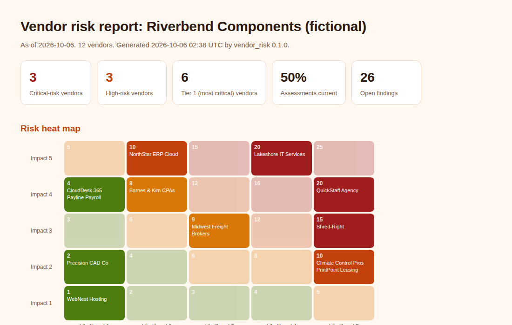

# Vendor Risk Dashboard

[](https://github.com/Edward-Owusu/vendor-risk-dashboard/actions/workflows/tests.yml)
[](LICENSE)

An open-source tool that helps **small and mid-sized organizations** manage the security risk that comes from their vendors and service providers. It scores every vendor on impact and likelihood, places them on a **risk heat map**, builds a **scorecard** for each one, and lists concrete fixes in contracts, assessments, and vendor controls, mapped to **NIST SP 800-53 Rev. 5** supply chain controls and the **NIST Cybersecurity Framework 2.0**.



## Why this matters

Many serious breaches start with a trusted vendor. Attackers who compromise an IT provider, a software supplier, or a contractor with remote access can reach every organization that vendor serves. Well-known examples include the 2013 Target breach, which began with credentials stolen from an HVAC contractor, and the 2021 Kaseya ransomware attack, which spread through managed service providers to hundreds of small businesses.

Small and mid-sized organizations depend on vendors more than most, since they outsource IT, payroll, accounting, hosting, and building systems, yet they rarely have a vendor risk program. Contracts often lack security terms, vendors are never assessed, and nobody knows which providers have remote access. NIST recognized this risk by adding a dedicated Cybersecurity Supply Chain Risk Management category (GV.SC) to the Cybersecurity Framework 2.0 in 2024.

This tool gives those organizations a simple, transparent way to see which vendors matter most, where the gaps are, and what to fix first. Better-managed vendor relationships protect not only each organization but the supply chains they are part of.

## What it does

- Scores each vendor's **impact** (data sensitivity, business criticality, privileged access) and **likelihood** (control strength from a short security questionnaire, certifications, recent breaches, remote access without MFA).
- Calculates **residual risk** (impact x likelihood) and assigns a band: Critical, High, Moderate, or Low.
- Places vendors on a **5 x 5 heat map** and builds a **scorecard** for each one.
- Assigns **tiers** and **reassessment due dates** (Tier 1 yearly, Tier 2 every two years, Tier 3 every three years) and flags overdue or never-assessed vendors.
- Applies **9 rules** for missing contract terms (security requirements, breach notification, right to audit, data return), vendor remote access without MFA, recent breaches, weak controls, and incomplete questionnaires.
- Maps every finding to **NIST SP 800-53 Rev. 5** controls (SR-6, SR-8, SA-9, SA-4, AC-17) and **CSF 2.0** subcategories (GV.SC-05, GV.SC-07, GV.SC-10, PR.AA-03).
- Uses a **transparent, adjustable scoring model**: every weight and threshold is in one file.
- Produces reports in **HTML, Markdown, CSV, and JSON**, with a command-line tool and an interactive **Streamlit dashboard**.
- Has **no third-party dependencies** in its core engine.

## Quick start

Requires Python 3.10 or later.

```bash
git clone https://github.com/Edward-Owusu/vendor-risk-dashboard.git
cd vendor-risk-dashboard
pip install -e .

vendor-risk samples/riverbend_components_vendors.csv --org "Riverbend Components" --format html md
```

Example output:

```
Riverbend Components | 12 vendors | as of 2026-10-06
Critical 3 | High 3 | Moderate 2 | Low 4 | Assessments current 50%
  Critical  20  Lakeshore IT Services (Tier 1, 5 findings)
  Critical  20  QuickStaff Agency (Tier 1, 5 findings)
  Critical  15  Shred-Right (Tier 2, 4 findings)
  High      10  NorthStar ERP Cloud (Tier 1, 3 findings)
  High      10  Climate Control Pros (Tier 3, 3 findings)
```

Open the HTML file in the `reports` folder for the heat map and scorecards. Pre-generated reports are in [docs/example-reports](docs/example-reports).

### Dashboard

```bash
pip install -r requirements.txt
streamlit run app/streamlit_app.py
```

### Use in automation

`--fail-on-band <band>` exits with code 2 when any vendor is in that band or worse, so the check can run on a schedule:

```bash
vendor-risk vendors.csv --fail-on-band Critical
```

## Using your own vendor list

1. Start from `samples/vendors_template.csv`, or export your vendor list from a spreadsheet, and add the columns described in the [data reference](docs/data-reference.md).
2. Send vendors the eight-question security questionnaire and record their answers.
3. Optionally adjust weights and thresholds in a copy of the [scoring model](src/vendor_risk/data/model.json).

## Related projects

This is the sixth tool in a series of open-source GRC tools for small and mid-sized organizations:

- [NIST SP 800-53 Assessment Tool](https://github.com/Edward-Owusu/Nist-800-53-assessment-tool)
- [Zero Trust IAM Auditor](https://github.com/Edward-Owusu/Zero-trust-iam-auditor)
- [MFA Compliance Tracker](https://github.com/Edward-Owusu/mfa-compliance-tracker)
- [FedRAMP Cloud Analyzer](https://github.com/Edward-Owusu/fedramp-cloud-analyzer)
- [CMMC Readiness Toolkit](https://github.com/Edward-Owusu/cmmc-readiness-toolkit)
- Vendor Risk Dashboard (this project)

## Data and limitations

All sample data is synthetic and does not describe any real organization or vendor. Scores come from a transparent prioritization model, not a statistical prediction of breach probability, and depend on the accuracy of the inventory and the vendors' self-reported answers. See the [methodology](docs/methodology.md).

## References

- NIST SP 800-53 Rev. 5, *Security and Privacy Controls for Information Systems and Organizations*, SR (Supply Chain Risk Management) family: https://csrc.nist.gov/pubs/sp/800/53/r5/upd1/final
- NIST Cybersecurity Framework 2.0 (2024), GV.SC Cybersecurity Supply Chain Risk Management: https://www.nist.gov/cyberframework
- NIST SP 800-161 Rev. 1, *Cybersecurity Supply Chain Risk Management Practices for Systems and Organizations*: https://csrc.nist.gov/pubs/sp/800/161/r1/final

## Author

**Edward Owusu, CISA**, GRC Analyst and IT Auditor.

Feedback, issues, and contributions are welcome. If you use this tool in your organization, I would be glad to hear how it worked for you; please open an issue or get in touch.

## Citation

If you use this tool in research or professional work, please cite it using the metadata in [CITATION.cff](CITATION.cff).

## License

[MIT](LICENSE)
